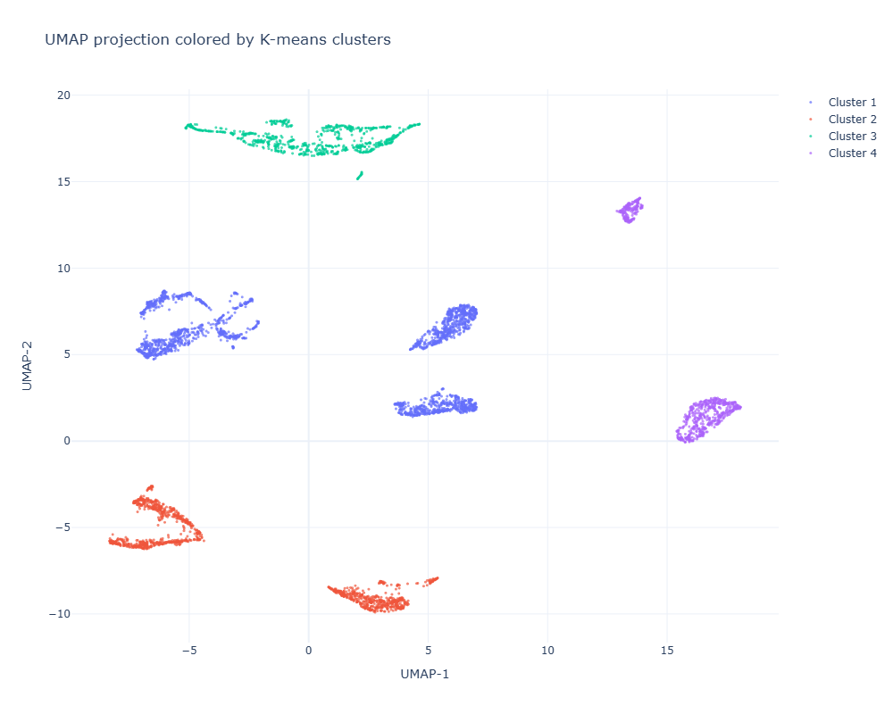
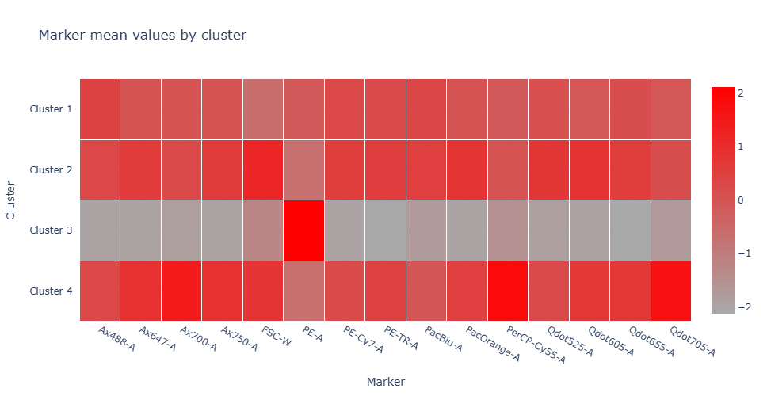
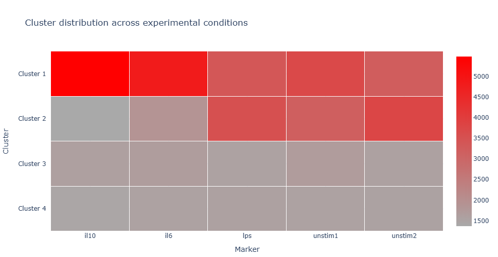
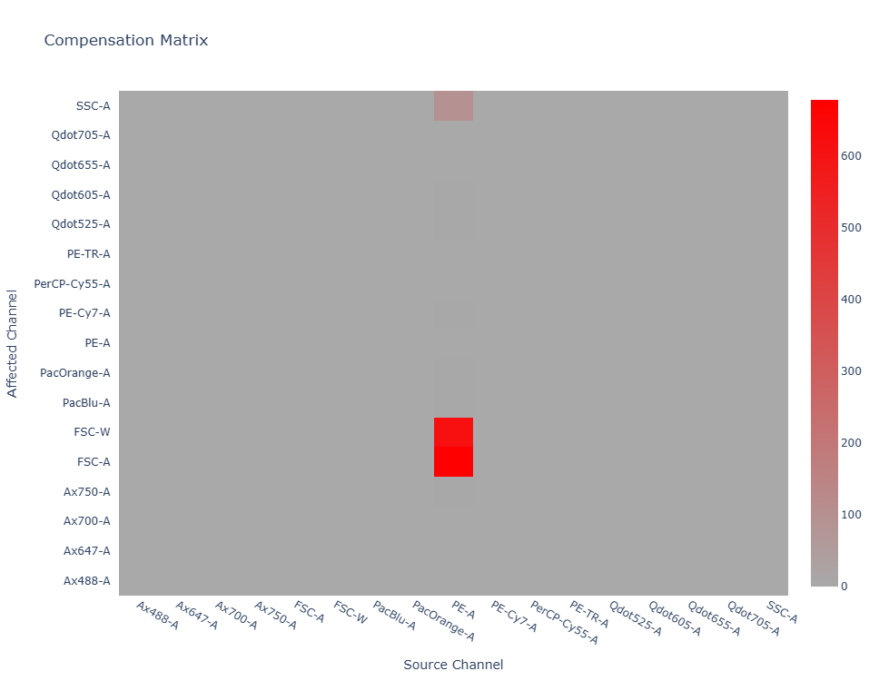

# 🔬 flow-cytometry-ml

Exploratory machine learning workflow for flow cytometry data using Python, FlowKit, UMAP, and unsupervised clustering.

---

## 📖 Overview

This project explores a complete preprocessing and exploratory machine learning pipeline for flow cytometry data analysis.

The notebook includes:
- loading and harmonizing `.fcs` cytometry files,
- fluorescence compensation reconstruction,
- arcsinh signal transformation,
- feature scaling,
- unsupervised clustering,
- UMAP visualization,
- marker enrichment analysis,
- and comparison of cellular populations across experimental conditions.

The goal of the project is not to produce clinically validated biological conclusions, but rather to demonstrate practical understanding of:
- cytometry preprocessing,
- single-cell exploratory analysis,
- and modern machine learning workflows applied to biological data.

---

## ⚙️ Installation

Clone the repository:

```bash
git clone https://github.com/AdrienMecibah/flow-cytometry-ml.git
cd flow-cytometry-ml
```

Create and activate a virtual environment:

```bash
python -m venv venv
```

### 🪟 Windows

```bash
venv\Scripts\activate
```

### 🐧 Linux / 🍎 macOS

```bash
source venv/bin/activate
```

Install the required dependencies:

```bash
pip install -r requirements.txt
```

---

## 🧪 Workflow

### 1. Data loading
Experimental samples and single-stain compensation controls are loaded from `.fcs` files using FlowKit.

### 2. Compensation
Fluorescence spillover between acquisition channels is estimated from single-stain controls and used to reconstruct a simplified compensation matrix.

### 3. Signal transformation
Fluorescence intensities are transformed using the arcsinh transform to compress extreme signal ranges while preserving low-intensity variation.

### 4. Feature scaling
Standardization is applied before machine learning to normalize channel distributions.

### 5. Clustering and visualization
K-means clustering and UMAP dimensionality reduction are used to explore cellular population structure.

### 6. Exploratory interpretation
Cluster distributions and marker expression patterns are compared across experimental conditions (`IL6`, `IL10`, `LPS`, unstimulated samples).

---

## 📊 Example Results

### UMAP projection colored by clusters



K-means clustering performed directly in the original feature space showed limited agreement with the nonlinear structure of the data. Clustering performed in the UMAP embedding space produced more coherent exploratory populations.

---

### Marker enrichment analysis



Although the average marker expression profiles remain relatively similar across clusters, Cluster 3 exhibits noticeably increased `PE-A` expression compared to the other populations. This enrichment is not associated with a strongly isolated UMAP region, suggesting that the corresponding variation may primarily affect localized marker intensity rather than the global manifold structure of the dataset.

---

### Cluster composition across experimental conditions



The relative abundance of clusters varies across stimulation conditions, suggesting that experimental treatments influence cellular population structure.

---

### Compensation matrix



Single-stain compensation controls were used to estimate fluorescence spillover coefficients between acquisition channels.

---

## 🛠️ Technologies

- Python
- Pandas
- NumPy
- Plotly
- Scikit-learn
- UMAP-learn
- FlowKit

---

## 🔍 Key observations

- Cytometry data exhibits strong nonlinear manifold structure.
- K-means clustering in the original feature space poorly captured this geometry.
- UMAP visualization revealed more coherent cellular populations.
- Cluster distributions differed across stimulation conditions.
- Cluster 3 exhibited reduced variability across several fluorescence channels.

---

## ⚠️ Limitations

- Compensation reconstruction was simplified.
- No expert biological gating was performed.
- Clustering remained fully unsupervised.
- No statistical hypothesis testing was conducted.
- Biological marker identities were only partially annotated.

---

## 🚀 Future improvements

Possible future extensions include:
- graph-based clustering methods (Leiden, HDBSCAN, FlowSOM),
- supervised classification,
- trajectory inference,
- batch correction,
- statistical differential analysis,
- and biological annotation of identified populations.

---

## 📁 Repository structure

```text
.
├── cytometry_pipeline.ipynb
├── data/
├── requirements.txt
├── LICENSE
├── README.md
└── .gitignore
```